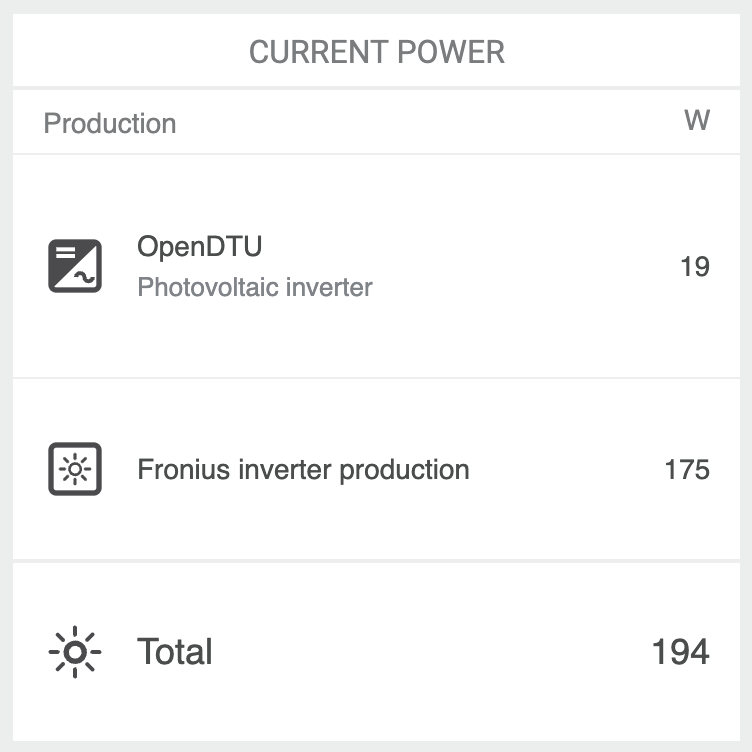

# OpenDTU with Modbus

For my personal needs, I wanted to have a smart meter with Modbus interface for my Hoymiles inverter. Instead of just buying one, I spend way too much time modifiying [OpenDTU](https://github.com/tbnobody/OpenDTU) of tbnobody to include this feature. Luckily, most of the work was already done, see the [acknowledgements](#acknowledgements).

## Additional Modbus Interface

OpenDTU is extended by a Modbus server as proposed in [PR#1893](https://github.com/tbnobody/OpenDTU/pull/1893) - see the original [fork of b0661](https://github.com/b0661/OpenDTU/tree/pr_modbus).

The Modbus server serves TCP at port 502.

* At Modbus ID 1 the server mimicks the Hoymiles Modbus TCP Interface registers in the original DTUPro.
* At Modbus ID 125 the server serves a SunSpec compatible "total inverter" that
provides the OpenDTU aggregated data from all registered inverters.
* At Modbus ID 127 the server serves a SunSpec power meter that provides AC power and AC yield as if measuring all registered inverters.

**Hint!** Configure your inverter(s) in OpenDTU's inverter setting with the "Zero runtime data" option set to "on" to have an output of 0 Watts when the inverter is offline.

The webapp is extended by Modbus configuration and info views.

The Modbus library used for Modbus communication is [eModbus](https://github.com/eModbus/eModbus).
Documentation for the library is [here](https://emodbus.github.io/).
**Note:** I've forked eModbus to change the dependency of AsyncTCP and ESPAsyncTCP from me-no-dev to mathieucarbou/AsyncTCP and esphome/ESPAsyncTCP-esphome for using the eModbus-library in openDTU.

### Homeassistant

Having the HACS addon [Hoymiles Plant DTU-Pro Sensor](https://github.com/ArekKubacki/Hoymiles-Plant-DTU-Pro) installed in Home Assistant, add to Home Assistant's configuration.yaml:

```yaml
sensor:
# change ip-address and panels to match your setup, the port is hardcoded to 502
  - platform: hoymiles_dtu
    host: 192.168.178.xxx
    name: Hoymiles PV
    # dtu_type for HM-type Inverter is 1
    dtu_type: 1
    monitored_conditions:
      - "pv_power"
      - "today_production"
      - "total_production"
      - "alarm_flag"
    monitored_conditions_pv:
      - "pv_power"
      - "today_production"
      - "total_production"
      - "pv_voltage"
      - "pv_current"
      - "grid_voltage"
      - "temperature"
      - "operating_status"
      - "alarm_code"
      - "alarm_count"
      - "link_status"
    panels: 3
```

**Hint!** Keep the port 502 and Modbus ID 1 for compatibility with HACS addon [Hoymiles Plant DTU-Pro Sensor](https://github.com/ArekKubacki/Hoymiles-Plant-DTU-Pro).

### Minimal SunSpec Meter

A minimal SunSpec compliant meter is available at Modbus ID 127. Only provides AC power and AC yield as if measuring the output of all registered inverters.
To be used e.g. as a "Fronius Smart Meter TCP" as orginally by [AloisKlingler](https://github.com/AloisKlingler/OpenDTU-FroniusSM-MB).

**Fixed:** This SunSpec Meter is functional now! Tested with [pySunSpec2](https://github.com/sunspec/pysunspec2).

See output of the [test script](test/Sunspec/test_pysunspec2_dtu_meter.py) against ID 127 (minmal meter):

```yaml
SunSpec compatibility test
using pySunSpec2

INFO: Test SunSpec-compatibility of 127 @ 192.168.178.112:502
INFO: open and scan device...

Got models:
  common
  ac_meter

common:
  ID:  1
  L:  65
  Mn:  OpenDTU
  Md:  OpenDTU Meter
  Opt:  Wemos D1 Mini 32
  Vr:  v24.11.7
  SN:  199980155940
  DA:  127

ac_meter:
  ID:  213
  L:  124
  A:  None
  AphA:  None
  AphB:  None
  AphC:  None
  PhV:  None
  PhVphA:  None
  PhVphB:  None
  PhVphC:  None
  PPV:  None
  PPVphAB:  None
  PPVphBC:  None
  PPVphCA:  None
  Hz:  None
  W:  -32.900001525878906
  WphA:  None
  WphB:  None
  WphC:  None
  VA:  None
  VAphA:  None
  VAphB:  None
  VAphC:  None
  VAR:  None
  VARphA:  None
  VARphB:  None
  VARphC:  None
  PF:  None
  PFphA:  None
  PFphB:  None
  PFphC:  None
  TotWhExp:  1307012.0
  TotWhExpPhA:  None
  TotWhExpPhB:  None
  TotWhExpPhC:  None
  TotWhImp:  0.0
  TotWhImpPhA:  None
  TotWhImpPhB:  None
  TotWhImpPhC:  None
  TotVAhExp:  None
  TotVAhExpPhA:  None
  TotVAhExpPhB:  None
  TotVAhExpPhC:  None
  TotVAhImp:  None
  TotVAhImpPhA:  None
  TotVAhImpPhB:  None
  TotVAhImpPhC:  None
  TotVArhImpQ1:  None
  TotVArhImpQ1phA:  None
  TotVArhImpQ1phB:  None
  TotVArhImpQ1phC:  None
  TotVArhImpQ2:  None
  TotVArhImpQ2phA:  None
  TotVArhImpQ2phB:  None
  TotVArhImpQ2phC:  None
  TotVArhExpQ3:  None
  TotVArhExpQ3phA:  None
  TotVArhExpQ3phB:  None
  TotVArhExpQ3phC:  None
  TotVArhExpQ4:  None
  TotVArhExpQ4phA:  None
  TotVArhExpQ4phB:  None
  TotVArhExpQ4phC:  None
  Evt:  0

INFO: close device...
INFO: Done!
```

### Full SunSpec Meter

A SunSpec compliant inverter is available at Modbus ID 125, which provides the OpenDTU aggregated data from all registered inverters. To be used e.g. in [evcc](https://evcc.io/).
**Fixed:** This SunSpec Meter is functional now! Tested with [pySunSpec2](https://github.com/sunspec/pysunspec2).

See output of the [test script](test/Sunspec/test_pysunspec2_dtu_total.py) against ID 125 (inverter):

```yaml
SunSpec compatibility test
using pySunSpec2

INFO: Test SunSpec-compatibility of 125 @ 192.168.178.112:502
INFO: open and scan device...

Got models:
  common
  model_12
  inverter

common:
  ID:  1
  L:  66
  Mn:  OpenDTU
  Md:  OpenDTU Total
  Opt:  Wemos D1 Mini 32
  Vr:  v24.11.7
  SN:  199980155940
  DA:  125
  Pad:  32768

model_12:
  ID:  12
  L:  98
  Nam:  wifi
  CfgSt:  1
  ChgSt:  0
  Cap:  16
  Cfg:  1
  Ctl:  0
  Addr:  192.168.178.112
  Msk:  255.255.255.0
  Gw:  192.168.178.1
  DNS1:  192.168.178.244
  DNS2:  0.0.0.0
  NTP1:  None
  NTP2:  None
  DomNam:  None
  HostNam:  OpenDTU
  Pad:  32768

inverter:
  ID:  111
  L:  60
  A:  None
  AphA:  None
  AphB:  None
  AphC:  None
  PPVphAB:  None
  PPVphBC:  None
  PPVphCA:  None
  PhVphA:  None
  PhVphB:  None
  PhVphC:  None
  W:  15.699999809265137
  Hz:  None
  VA:  None
  VAr:  None
  PF:  None
  WH:  1306962.875
  DCA:  None
  DCV:  None
  DCW:  16.5
  TmpCab:  None
  TmpSnk:  None
  TmpTrns:  None
  TmpOt:  None
  St:  0
  StVnd:  0
  Evt1:  0
  Evt2:  0
  EvtVnd1:  0
  EvtVnd2:  0
  EvtVnd3:  0
  EvtVnd4:  0

INFO: close device...
INFO: Done!
```

### Modbus Interface Details

The Modbus TCP server is available by default at port 502 and supports modbus FC03: READ_HOLD_REGISTER.

#### Hoymiles Modbus TCP Interface registers

The Modbus ID of the Hoymiles Modbus TCP Interface is 1 by default.
See: [src/ModbusDtuPro.cpp](https://github.com/soylentOrange/OpenDTU/blob/add-modbus/src/ModbusDtuPro.cpp) for the actually implemented registers.

#### Minimal SunSpec Meter Interface registers

The Modbus ID of the minimal SunSpec meter is 127 by default.
See: Model 213 - Wye-Connect Meter Model (float) in the [SunSpec Model repository](https://github.com/sunspec/models) for all of the registers and [src/ModbusDtuMeter.cpp](https://github.com/soylentOrange/OpenDTU/blob/add-modbus/src/ModbusDtuMeter.cpp) for the actually implemented registers.
For a secondary production meter, added via modbus to a Fronius inverter (doesn't apply to all of their models), only a subset of the SunSpec mandatory points seems required:

* Total Real Power (in W): Point 'W' in model 213 at offset 26
* Total Real Energy Exported (in Wh): Point 'TotWhExp' in model 213 at offset 58

Additional Info when using the Minimal SunSpec Meter with Your Inverter:

* The current firmware for my inverter will accept only a limited range for the modbus ID (thus, I changed the default value to 127)
* The SunSpec model of the meter needs to be Model 213 - Wye-Connect Meter Model (float). Otherwise my inverter refused service.
* Adding OpenDTU to the inverter is done by adding a component to your system (Production meter, Category: Inverter, Modbus Address: 127)
* **Note**: You need to have the technician password in order to add OpenDTU to your inverter



#### Full SunSpec Meter Interface registers

The Modbus ID of the total SunSpec meter is 125 by default.
See: Model 111 - Inverter (Single Phase) FLOAT Model in the [SunSpec Model repository](https://github.com/sunspec/models) for all of the registers and [src/ModbusDtuTotal.cpp](https://github.com/soylentOrange/OpenDTU/blob/add-modbus/src/ModbusDtuTotal.cpp) for the actually implemented registers.
For an inverter in pv usage mode, EVCC (see [sunspec-inverter template](https://github.com/evcc-io/evcc/blob/master/templates/definition/meter/sunspec-inverter.yaml)) needs only:

* AC Power (in W): point 'W' in model 111 at offset 20
* AC Energy (in Wh): point 'WH' in model 111 at offset 30

## Build the firmware image

Clone this repository, switch to branch "add-modbus" and compile following the guide of [OpenDTU](https://www.opendtu.solar/firmware/compile_vscode/).

You (probably) do not have to compile the webapp (see [OpenDTU guide](https://www.opendtu.solar/firmware/compile_webapp/)) in advance as an updated webapp is alread part of this repository. Use the included OpenDTU_yarn.yaml with the VSCode Extension Conda Wingman to create an envorinment with the required dependencies for builing the webapp.

## Background

This project was started from [this](https://www.mikrocontroller.net/topic/525778) discussion (Mikrocontroller.net).
It was the goal to replace the original Hoymiles DTU (Telemetry Gateway) with their cloud access. With a lot of reverse engineering the Hoymiles protocol was decrypted and analyzed.

## Documentation

The documentation can be found [here](https://tbnobody.github.io/OpenDTU-docs/).
Please feel free to support and create a PR in [this](https://github.com/tbnobody/OpenDTU-docs) repository to make the documentation even better.

## Currently supported Inverters

A list of all currently supported inverters can be found [here](https://www.opendtu.solar/hardware/inverter_overview/)

## Acknowledgements

* This fork is based on the great project [OpenDTU](https://github.com/tbnobody/OpenDTU) of tbnobody.

* [eModbus](https://github.com/eModbus/eModbus) is a great piece of software. To handle the dependencies, I've [forked](https://github.com/soylentOrange/eModbus) the repo and changed the AsyncTCP library from me-no-dev to use mathieucarbou's AsyncTCP library.

* Finally, this fork is including a Modbus server as proposed in openDTU's [PR#1893](https://github.com/tbnobody/OpenDTU/pull/1893) - see the original [fork of b0661](https://github.com/b0661/OpenDTU/tree/pr_modbus). I merely ported the modbus functions to the current version of openDTU and got everything in working order.
